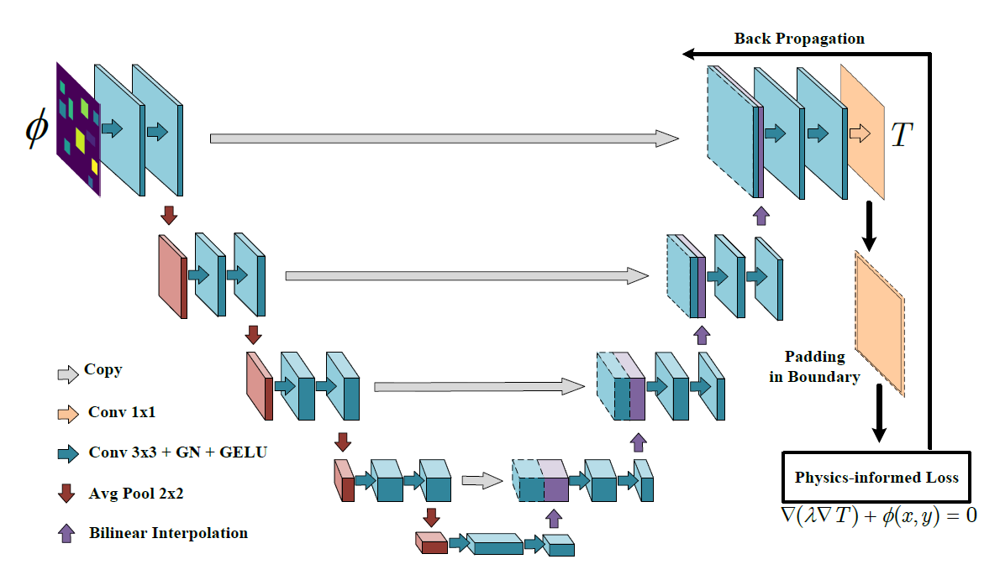
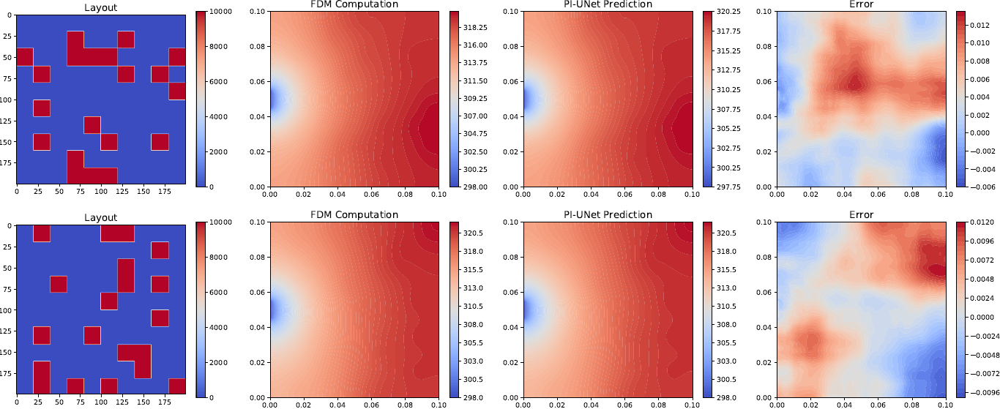
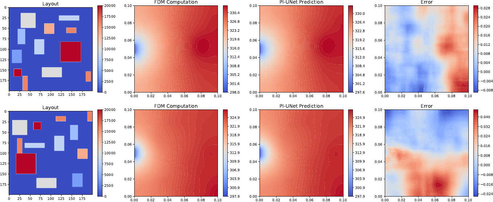

# Physics-Informed CNNs for the Poisson Equation 

This repository contains the implementation of my Bachelor's thesis.
It reproduces the PI-UNet framework of [Zhao et al. (2023)](https://doi.org/10.1016/j.engappai.2022.105516) and extends it with **Gaussian blur** and **Gaussian noise** perturbations to systematically study model robustness.  

---

## 📌 Overview

- **Pipeline of the method**  

  

- **Visualization of steady-state temperature fields** obtained with the Finite Difference Method (FDM) and PI-UNet-based models.  

  *Case with simple heat source layout:*  
    

  *Case with complex heat source layout:*  
    

---

## ⚙️ Environment

Make sure to install the correct version of PyTorch Lightning:  

```shell
torch==1.12.1+cu113
torchvision==0.13.1+cu113
pytorch-lightning==1.1.0
tensorboard
opencv-python
numpy
matplotlib
```  


---

## 📂 Data Preparation

Datasets used in this thesis are based on layouts from Zhao et al.  
If you generate or download datasets, update the configuration file (e.g., `config_ul.yml`) with your own paths:

```yaml
data_root: /path/to/dataset/FDM
train_list: /path/to/train.txt
val_list: /path/to/val.txt
test_list: /path/to/test.txt
``` 

---
## ▶️ Train and Test

```shell
cd example
python train_ul.py
```
Update the checkpoint path in test.py to point to your saved model before running: and
```shell
python test.py
```

---
## 🔧 Perturbation Settings

The perturbation-aware extensions (Gaussian blur and additive Gaussian noise) are implemented in:
```shell
custom_transform.py
```

The intensity and usage of these perturbations are fully controlled through the YAML configuration files.  
